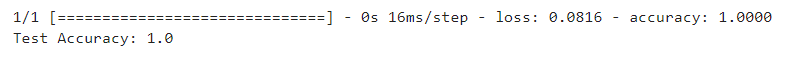

# Tree-Classification Made With Python
The project entails the development of a classification system capable of identifying tree species based on three key features extracted from leaf samples: the Apex angle, Base angle, and the Ratio of Height to Width of the leaf.
The system is designed to classify leaves into three distinct categories corresponding to different tree species: Jack, Cashew, and Banyan.

<h3>Performance Graph </h3>
</img>

<h3>Performance </h3>
</img>
</img>
</img>
